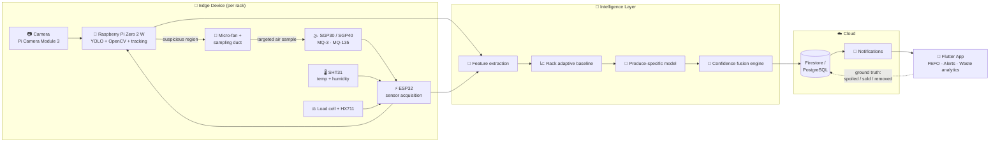
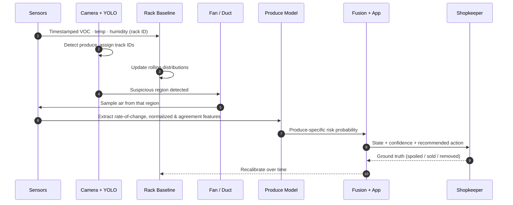

<div align="center">


<a href="https://git.io/typing-svg">
  
</a>

<br/>


**A low-cost, portable, rack-level monitoring platform that fuses vision, gas sensing and inventory intelligence to cut fresh-produce waste in small grocery stores.**

[Overview](#-overview) •
[Architecture](#-system-architecture) •
[Features](#-core-modules) •
[Hardware](#-hardware-bill-of-materials) •
[Roadmap](#-roadmap) •
[Validation](#-validation-plan) •
[Getting Started](#-getting-started)

</div>

---

## 🥬 Overview

Most spoilage tools answer one question: *"Is something rotten?"*

**Smart Grocer** answers the questions a shopkeeper actually needs answered:

> **Which** item or rack is at risk? **Why** does the system think so? **How much** stock is affected? **What should I do** right now?

It combines computer vision, VOC/gas sensing, temperature and humidity compensation, weight tracking, barcode/OCR expiry reading and adaptive baselines into a single edge device that turns raw sensor evidence into **explainable, actionable recommendations**.

| 😩 The problem | ✅ The Smart Grocer approach |
|---|---|
| Spoilage is noticed only when it is already visible | Early-warning from gas trends fused with visual evidence |
| One spoiled item contaminates the sale of the whole rack | Item-level localization pinpoints *which* produce is at risk |
| Fixed global gas thresholds fail in real shops | Rack-specific adaptive baselines learn each rack's "normal" |
| Alerts without context get ignored | Every alert carries a state, a confidence score and a recommended action |
| Expensive commercial systems are out of reach for small stores | Prototype BOM of roughly ₹9,000–₹15,000 per rack |

---

## 🧠 How It Works

```
   📷 See          🌫️ Smell         🌡️ Context        ⚖️ Weigh         🏷️ Read
 YOLO + OpenCV   VOC / gas array   Temp + humidity    Load cell       Barcode + OCR
       │              │                  │                │                │
       └──────────────┴────────┬─────────┴────────────────┴────────────────┘
                               ▼
                 🔀 Multimodal confidence fusion
                               ▼
        Fresh  →  Monitor  →  At Risk  →  Confirmed visual spoilage
                               ▼
              💡 Explainable action  (inspect · discount · move to front · remove)
```

---

## 🏗️ System Architecture

> **Principle:** the edge device collects multimodal evidence → edge AI localizes objects and does low-latency processing → the fusion engine combines spatial, temporal, environmental and chemical signals → the cloud stores history and sends notifications → the app converts predictions into actions.



---

## 🧩 Core Modules

<table>
<tr>
<td width="50%" valign="top">

### 👁️ A. Computer Vision
YOLO/OpenCV detects individual produce items; bounding boxes and item IDs are tracked over time.

### 🌫️ B. Gas / VOC Sensing
SGP30 (or equivalent) plus an optional MQ-3 / MQ-135 array. Readings are treated as **trends and features**, never a single universal threshold.

### 🌡️ C. Environmental Sensing
SHT31 / BME280 compensates for temperature and humidity effects on gas readings.

### 🎯 D. Localized Sampling
A micro-fan and small airflow channel pull air from a camera-selected region for targeted confirmation.

### 🧬 E. Adaptive Rack Fingerprint
Learns each rack's normal temporal/environmental profile and flags deviations *relative to that rack*.

</td>
<td width="50%" valign="top">

### 🔀 F. Multimodal Confidence Fusion
Visual + gas + climate + time history + produce type are fused into **Fresh / Ripening / At Risk / Spoilage** with a confidence score.

### ⚖️ G. Weight Monitoring
Load cell + HX711 tracks stock-weight trends and estimates quantity remaining and potentially affected.

### 🏷️ H. Barcode / OCR Inventory
Barcode identifies packaged products; OCR reads printed expiry/batch info. Treated as two separate functions.

### 📋 I. FEFO / Action Engine
First-Expire-First-Out recommendations: inspect, discount, remove or restock.

### 📉 J. Waste Analytics
Records spoiled / expired / damaged / sold quantities and estimates avoidable loss over time.

</td>
</tr>
</table>

---

## 🔬 Research Directions

Smart Grocer is designed around a specific technical combination rather than the broad idea of "gas + camera + app", which already exists in the literature.

| # | Direction | Idea |
|:-:|---|---|
| 1 | **Spatial gas attribution** | Use camera coordinates to pick a region around a suspicious item, then sample air *there* instead of treating the whole rack as one gas volume. |
| 2 | **Rack-specific adaptive baseline** | Detect abnormal trajectories relative to each rack's own history, not a fixed global threshold. |
| 3 | **Sensor-confidence fusion** | Never declare spoilage from a single sensor; combine image, gas trend, environment and temporal acceleration. |
| 4 | **Produce-specific models** | Select a calibration profile per produce class. |
| 5 | **Item-level risk + action** | Translate evidence into inspect / remove / move-to-front / discount / monitor. |
| 6 | **Weight + freshness fusion** | Estimate stock and the quantity that is affected. |
| 7 | **Closed-loop learning** | Recalibrate from shop-specific ground truth (confirmed spoiled / removed / sold). |

> [!NOTE]
> These are **research directions under investigation**, not claims of novelty or patentability. Related work exists for gas baselines, image + gas fusion and multisensor perishable monitoring. The contribution to be demonstrated is the specific mechanism, supported by ablation experiments (see [Validation Plan](#-validation-plan)).

---

## 🔌 Hardware Bill of Materials

<details>
<summary><b>Click to expand the full prototype BOM (single-rack)</b></summary>

<br/>

| Component | Purpose | Qty | Est. cost (INR) |
|---|---|:-:|---|
| Raspberry Pi Zero 2 W | Edge computer / camera processing | 1 | ₹1,700 – ₹3,000 |
| Raspberry Pi Camera Module 3 (or compatible) | Rack imaging | 1 | ₹2,300 – ₹3,500 |
| ESP32 | Sensor controller / connectivity | 1 | ₹400 – ₹700 |
| SGP30 / equivalent VOC sensor | TVOC + eCO₂ trend | 1 | ₹500 – ₹1,000 |
| SHT31 / equivalent | Temperature + humidity | 1 | ₹300 – ₹600 |
| MQ-3 | Broad gas response (experimental feature) | 1 | ₹90 – ₹150 |
| MQ-135 | Broad air-quality response (experimental feature) | 1 | ₹90 – ₹150 |
| 5 kg / 10 kg load cell | Rack / tray weight | 1 | ₹150 – ₹350 |
| HX711 | Load-cell ADC | 1 | ₹50 – ₹150 |
| Micro-fan / blower | Targeted air sampling | 1 | ₹100 – ₹300 |
| Air channel / sampling manifold | Localized gas sampling (3D printed) | 1 | ₹100 – ₹400 |
| Barcode scanner *(optional for V1)* | Packaged-product barcode | 1 | ₹1,500 – ₹3,500 |
| 18650 battery + protection / charging | Portable power | 1 | ₹150 – ₹400 |
| 5V regulator / power module | Stable Pi / sensor power | 1 | ₹100 – ₹300 |
| microSD card (16–32 GB) | Pi storage | 1 | ₹300 – ₹600 |
| Custom / 3D-printed enclosure | Mechanical housing with vents | 1 | ₹300 – ₹800 |
| PCB / perfboard / connectors / wires | Integration | 1 set | ₹400 – ₹1,000 |

**Notes**
- The SGP30 is marked end-of-life by Sensirion. Prefer **SGP40** for a production design if sourcing allows.
- MQ-3 and MQ-135 are broad-response sensors, not calibrated spoilage detectors. Use them only as features in a calibrated array.
- Use protected 18650 cells with a proper charger / BMS.

</details>

### 💰 Budget at a glance

| Build | Approx. cost |
|---|---|
| 🧪 **Proof-of-concept** — ESP32 + phone camera / barcode + gas & climate sensors | **₹4,000 – ₹7,000** |
| 🚀 **Full single-rack prototype** — Pi + camera + sensors + load cell + sampling hardware + barcode | **₹9,000 – ₹15,000** |

> The prototype BOM is not a manufacturing BOM. Multi-rack pilots need one sensing/edge node per rack plus a shared backend.

---

## 🛠️ Tech Stack

| Layer | Tools |
|---|---|
| **Firmware** | ESP-IDF or Arduino framework (ESP32) · Python services on Raspberry Pi |
| **Edge OS** | Raspberry Pi OS Lite |
| **Computer vision** | Python · OpenCV · Ultralytics YOLO (detection first, tracking next) |
| **OCR** | PaddleOCR or Tesseract |
| **Barcode** | ZXing / pyzbar, or a USB/UART scanner |
| **ML / fusion** | pandas · NumPy · scikit-learn · Random Forest / XGBoost baselines · TFLite / ONNX Runtime for the edge |
| **Backend** | Firebase Auth + Firestore + Cloud Functions / Cloud Run *(or FastAPI + PostgreSQL)* |
| **Notifications** | Firebase Cloud Messaging |
| **Mobile app** | Flutter (Android + iOS) |
| **Experiment tracking** | MLflow or versioned JSON/CSV |
| **CAD** | Fusion 360 / FreeCAD |

---

## 🔄 Data & ML Pipeline



Every sensor reading carries a timestamp and device/rack ID; every camera frame carries a timestamp, rack ID and camera pose.

---

## 🧪 Validation Plan

The project is only as strong as its evidence. Planned experiments:

| Experiment | What is measured |
|---|---|
| 🍅 Controlled produce run | Fresh → ripening → spoilage on one produce type (e.g. tomato) with sensors, images and weight |
| 🚬 Ambient interference | Smoke, perfume, human presence, exhaust, neighbouring produce → false-positive rate |
| 💡 Lighting | Daylight, warm indoor light, shadows, partial occlusion |
| 🥕 Rack mixing | Cross-contamination of gas signals between produce types |
| 🧫 **Ablation study** | Camera only · gas only · camera + gas · + adaptive baseline · + localized sampling · full system |
| 🏪 Cross-shop | Train on some stores, test on an unseen one |
| ⏱️ Lead time | Hours between the first validated warning and obvious visual spoilage |
| 🎯 Localization | Correct item / rack identified |
| ⚖️ Inventory | Estimated vs. actual weight / quantity |
| 🏷️ Expiry | Barcode / OCR accuracy and false-reminder rate |

---

## 🗺️ Roadmap

- [ ] **MVP-1** — ESP32 + SGP30/SGP40 + SHT31 + MQ-3/MQ-135, synchronized sensor data collection
- [ ] **MVP-2** — Raspberry Pi Zero 2 W + camera, YOLO produce detection and rack visualization
- [ ] **MVP-3** — Adaptive rack baseline + multimodal risk classifier
- [ ] **MVP-4** — Load cell + stock-weight analytics
- [ ] **MVP-5** — Barcode / OCR expiry management + FEFO
- [ ] **Research V1** — Camera-guided localized gas sampling, benefit quantified by ablation
- [ ] **Pilot** — Deploy in 3–10 real shops, collect ground truth, refine calibration, measure waste reduction and false alerts

> Update the checkboxes as milestones land. GitHub renders them as a live progress list.

---

## 🚀 Getting Started

> [!IMPORTANT]
> Smart Grocer is in active prototype development. The commands below describe the intended project layout; adjust them to match the repository as it evolves.

```bash
# 1. Clone
git clone https://github.com/<your-username>/smart-grocer.git
cd smart-grocer

# 2. Create an environment
python -m venv .venv
source .venv/bin/activate          # Windows: .venv\Scripts\activate

# 3. Install dependencies
pip install -r requirements.txt
```

### 📁 Suggested repository layout

```
smart-grocer/
├── firmware/          # ESP32 sensor acquisition (SGP30, SHT31, MQ, HX711)
├── edge/              # Pi services: camera, YOLO, tracking, sampling controller
├── ml/                # feature extraction, baselines, fusion models, notebooks
├── backend/           # Firebase functions or FastAPI service
├── app/               # Flutter mobile app
├── hardware/          # CAD files, wiring diagrams, BOM
├── data/              # synchronized sensor + image logs (gitignored if large)
├── experiments/       # ablation studies and experiment tracking
└── docs/              # technical blueprint, diagrams, images
```

---

## 📚 References

- [Raspberry Pi Zero 2 W specifications](https://www.raspberrypi.com/products/raspberry-pi-zero-2-w/)
- [Raspberry Pi Zero 2 W product brief](https://pip-assets.raspberrypi.com/categories/584-raspberry-pi-zero-2-w/documents/RP-008359-DS-1-raspberry-pi-zero-2-w-product-brief.pdf)
- [Sensirion SGP30](https://sensirion.com/products/catalog/SGP30)
- Related prior art reviewed: [WO2024238899A1](https://patents.google.com/patent/WO2024238899A1/en) · [US12038427B2](https://patents.google.com/patent/US12038427B2/en)

---

## 🤝 Contributing

Ideas, issues and pull requests are welcome, especially around sensor calibration, datasets and shop-floor testing.

1. Fork the repo
2. Create a branch: `git checkout -b feature/your-feature`
3. Commit: `git commit -m "Add your feature"`
4. Push and open a Pull Request

---

## 📬 Contact

**Hema** · [GitHub](https://github.com/<your-username>) · [LinkedIn](https://linkedin.com/in/<your-handle>) · <your-email@example.com>

<div align="center">

⭐ **If this project helps you, give it a star.** ⭐


</div>
